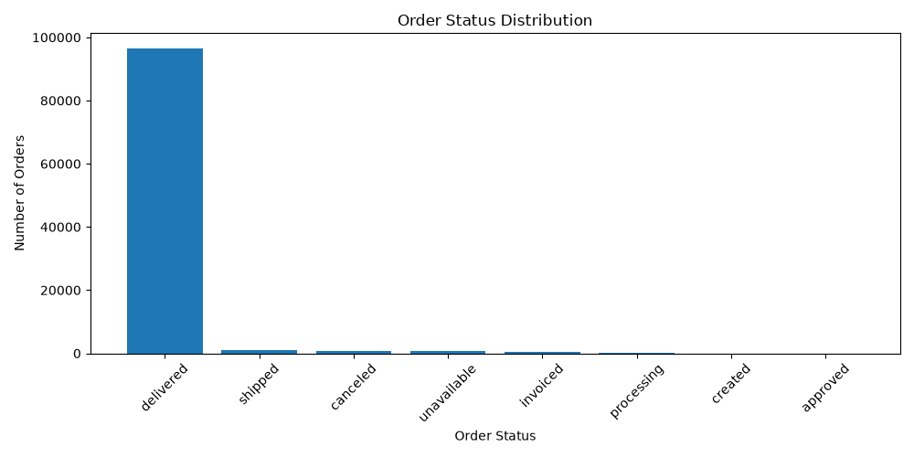
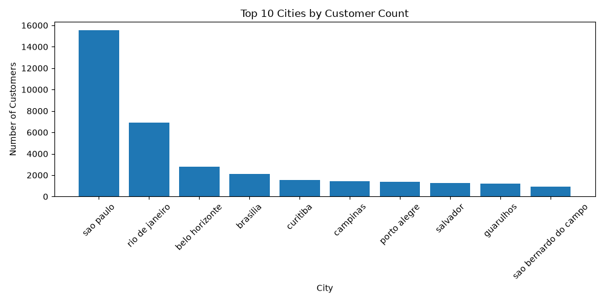
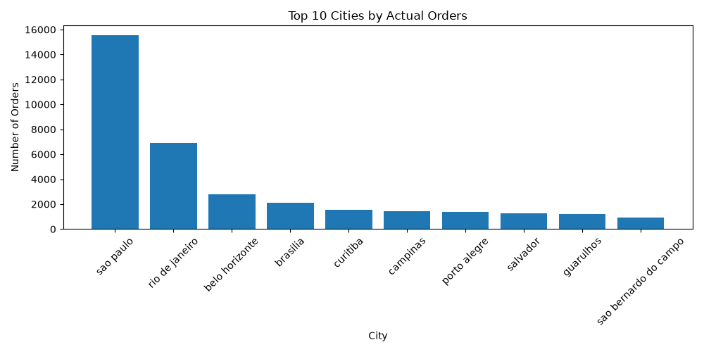
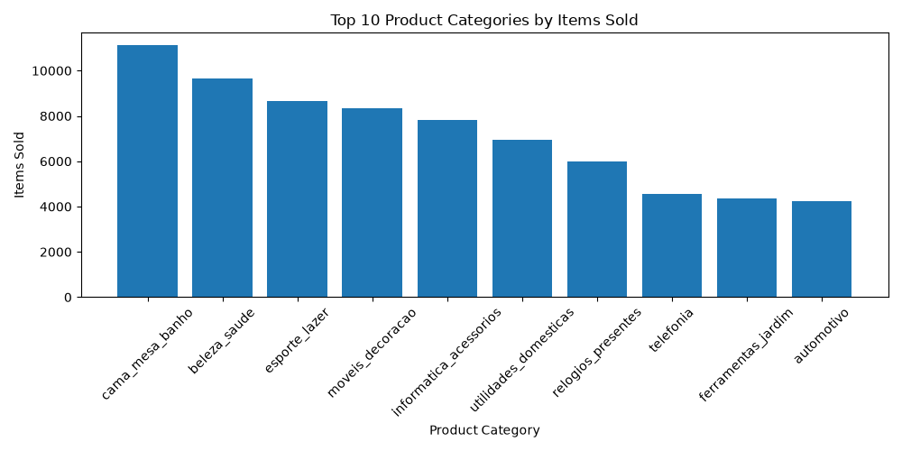

### \# Olist E-Commerce Data Analysis


### \## Project overview

This project analyzes the Olist Brazilian E\_Commerce Dataset to understand customer behavior, under performance, product demand, paymant methods, and customer satisfaction.


The analysis focuses on identifying key business patterns and generating actionable insight that can help improve e-commerce perfomance and customer experience. 


### \## Business Questions

This analysis aim to answer the following business questions:


1. Which cities generate the highest number of order?
2. Which product categories have a highest demand?
3. Which payment methods are most commonly used by customers?
4. What is the distribution of customer review scores?
5. What are the most common order statuses?
6. What business patterns can be identified from customer order, prodeuct, payment, and reviews?


### \## Dataset \& Data Sources

This project uses the Brazilian E-Commerce Public Dataset by Olist


The dataset contains information about orders, customers, products, payment, \& customer reviews.


##### \### Main Datasets

\- `olist\_orders\_dataset.csv` — order information and order status

\- `olist\_customers\_dataset.csv` — customer information and location

\- `olist\_order\_items\_dataset.csv` — products included in each order

\- `olist\_products\_dataset.csv` — product information and categories

\- `olist\_order\_payments\_dataset.csv` — payment information

\- `olist\_order\_reviews\_dataset.csv` — customer review scores


The datasets were connected using common identifiers such as `order\_id`, `customer\_id`, and `product\_id` to support the analysis.


### \## Tools \& Technologies


\- \*\*Python\*\* — Programming language used for data analysis

\- \*\*Pandas\*\* — Data manipulation, aggregation, and data processing

\- \*\*Matplotlib\*\* — Data visualization

\- \*\*Jupyter Notebook\*\* — Exploratory data analysis and experimentation

\- \*\*CSV\*\* — Dataset storage format

\- \*\*GitHub\*\* — Project documentation and portfolio presentation

### 

### \## Data Analysis \& Visualization


##### \### 1. Order Status Analysis


The analysis shows the distribution of orders across different order statuses.





The majority of orders were successfully delivered, while canceled and unavailable orders represented only a small portion of the total orders.


##### \### 2. Top 10 Cities by Number of Orders


The analysis identifies the cities with the highest number of customer orders.





São Paulo generated the highest number of orders, followed by Rio de Janeiro and Belo Horizonte.


##### \### 3. Top 10 Cities by Actual Orders


A second city analysis was performed to validate the order volume using actual order-level data.





São Paulo remained the city with the highest order volume, confirming the result of the initial city analysis.


##### \### 4. Top 10 Product Categories


The analysis identifies the product categories with the highest number of items sold.





The `cama\_mesa\_banho` category had the highest item volume, followed by `beleza\_saude` and `esporte\_lazer`.


##### \### 5. Payment Analysis


The analysis compares payment methods based on transaction volume and total revenue.


Credit card was the dominant payment method and generated the highest total revenue among the available payment types.


##### \### 6. Customer Review Analysis


The analysis examines the distribution of customer review scores.


The majority of customers gave a 5-star rating, indicating generally positive customer satisfaction. However, the number of 1-star reviews also represents an important area for further investigation.


### \## Key Findings


##### \### Order Performance


\- Total orders: \*\*99,441\*\*

\- Delivered orders: \*\*96,478\*\*

\- Delivered orders represented the vast majority of all orders.

\- Canceled orders: \*\*625\*\*

\- Unavailable orders: \*\*609\*\*


##### \### Customer Location


\- São Paulo recorded the highest number of orders with \*\*15,540\*\*.

\- Rio de Janeiro followed with \*\*6,882\*\* orders.

\- Other major cities such as Belo Horizonte, Brasília, and Curitiba also contributed significant order volumes.


##### \### Product Demand


The top product categories by item volume were:


1\. \*\*Cama, Mesa e Banho\*\* — 11,115 items

2\. \*\*Beleza \& Saúde\*\* — 9,670 items

3\. \*\*Esporte \& Lazer\*\* — 8,641 items

4\. \*\*Móveis \& Decoração\*\* — 8,334 items

5\. \*\*Informática \& Acessórios\*\* — 7,827 items


##### \### Payment Methods


\- \*\*Credit card\*\* was the most frequently used payment method with \*\*76,795 payments\*\*.

\- Credit card payments generated approximately \*\*12.54 million\*\* in total revenue.

\- Boleto was the second most-used payment method with \*\*19,784 payments\*\*.

\- The `not\_defined` payment category contained only 3 records and generated no revenue.


##### \### Customer Reviews


\- \*\*5-star reviews:\*\* 57,328

\- \*\*4-star reviews:\*\* 19,142

\- \*\*3-star reviews:\*\* 8,179

\- \*\*2-star reviews:\*\* 3,151

\- \*\*1-star reviews:\*\* 11,424


The high number of 5-star reviews indicates generally positive customer satisfaction. However, the \*\*11,424 one-star reviews\*\* represent a significant opportunity for further investigation.


### \## Business Insights


##### \### 1. Strong Demand in Major Cities


The analysis shows that customer orders are highly concentrated in major Brazilian cities, with São Paulo generating the highest number of orders at \*\*15,540\*\*, followed by Rio de Janeiro with \*\*6,882\*\*.


This suggests that large metropolitan areas represent important markets for Olist. Higher population density and a larger customer base may contribute to the concentration of orders in these cities.


##### \### 2. Cama, Mesa e Banho Shows Strong Product Demand


The `cama\_mesa\_banho` category recorded the highest number of items sold with \*\*11,115 items\*\*.


This indicates strong demand for household-related products and suggests that this category may represent an important contributor to overall sales volume.


##### \### 3. Credit Card Is the Dominant Payment Method


Credit card was used for \*\*76,795 payments\*\*, significantly higher than other payment methods.


This indicates that customers strongly prefer digital and installment-friendly payment options. Maintaining a reliable credit card payment experience is therefore important for customer convenience and revenue generation.


##### \### 4. Customer Satisfaction Is Generally Positive


The dataset contains \*\*57,328 five-star reviews\*\*, making it the largest review category.


This suggests that a large proportion of customers had a positive experience with their orders.


However, there were also \*\*11,424 one-star reviews\*\*, which is significant enough to require further investigation.


Potential causes may include delivery problems, product quality issues, delays, or differences between customer expectations and the received products.


##### \### 5. Order Fulfillment Performance Is Strong


With \*\*96,478 delivered orders out of 99,441 total orders\*\*, the majority of orders successfully reached customers.


This indicates relatively strong order fulfillment performance, although canceled, unavailable, and delayed orders should still be monitored to identify opportunities for operational improvement.


### \## Business Recommendations


Based on the analysis, the following recommendations can be considered:


##### \### 1. Focus Marketing on High-Demand Cities


Olist should prioritize marketing campaigns and customer acquisition strategies in cities with high order volumes, particularly São Paulo and Rio de Janeiro.


However, the company should also evaluate customer acquisition costs and market potential before allocating additional resources.


##### \### 2. Maintain and Expand High-Demand Product Categories


The `cama\_mesa\_banho` category recorded the highest item volume.


Olist should maintain product availability in this category and evaluate opportunities to expand its product selection, promotions, and marketing campaigns.


Other high-performing categories such as `beleza\_saude` and `esporte\_lazer` should also be monitored for potential growth opportunities.


##### \### 3. Continue Supporting Credit Card Payments


Credit card is clearly the dominant payment method.


Olist should maintain a reliable credit card payment experience while continuing to support alternative payment methods such as boleto, voucher, and debit card.


This helps ensure that customers with different payment preferences are not excluded.


##### \### 4. Investigate One-Star Reviews


Although five-star reviews are dominant, the dataset contains \*\*11,424 one-star reviews\*\*.


Olist should investigate the main causes of these negative reviews by analyzing additional factors such as:


\- Delivery delays

\- Product categories

\- Product quality

\- Seller performance

\- Shipping issues

\- Customer service


Identifying the main causes could help reduce negative experiences and improve customer satisfaction.


##### \### 5. Monitor Order Fulfillment


Olist should continue monitoring canceled, unavailable, processing, and other non-delivered order statuses.


Further investigation into these orders could help identify operational problems and improve the overall customer experience.


### \## Project Structure


```text

Olist\_E-Commerce\_Analysis/

│

├── data/

│   ├── olist\_orders\_dataset.csv

│   ├── olist\_customers\_dataset.csv

│   ├── olist\_order\_items\_dataset.csv

│   ├── olist\_products\_dataset.csv

│   ├── olist\_order\_payments\_dataset.csv

│   └── olist\_order\_reviews\_dataset.csv

│

├── notebooks/

│   └── olist\_ecommerce\_analysis.ipynb

│

├── scripts/

│   └── olist\_analysis.py

│

├── visualization/

│   ├── customer\_reviews.png

│   ├── order\_status.png

│   ├── payment\_methods.png

│   ├── top\_cities.png

│   ├── top\_cities\_actual\_orders.png

│   └── top\_product\_categories.png

│

└── README.md


### \## Conclusion


This project demonstrates how Python and Pandas can be used to analyze an e-commerce dataset and transform raw transactional data into meaningful business insights.


The analysis identified key patterns in customer locations, product demand, payment preferences, order fulfillment, and customer satisfaction.


The results also highlight several areas for further investigation, particularly negative customer reviews and non-delivered orders.


Overall, the project demonstrates an end-to-end analytical workflow:


\*\*Data Preparation → Data Analysis → Visualization → Business Insights → Recommendations\*\*


